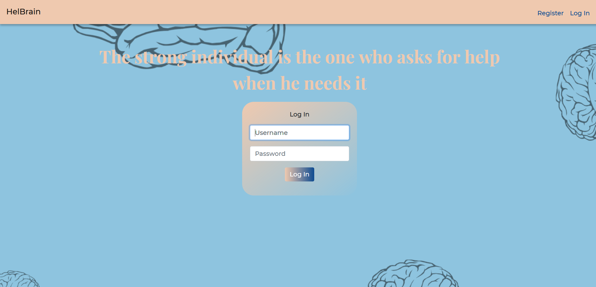
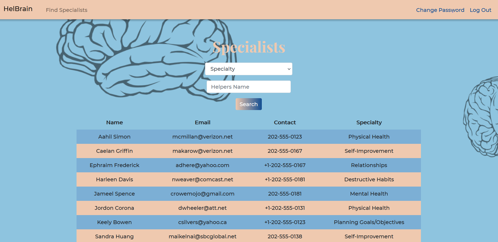
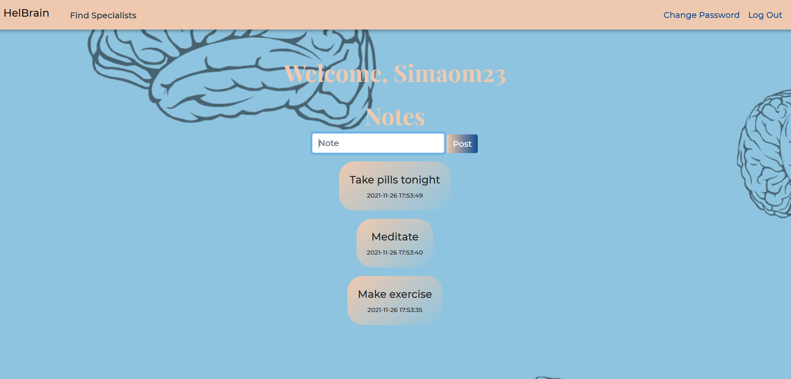

# HelBrain

#### Video Demo: [See Here](https://youtu.be/ldh5xJSPGfQ)

#### Description:

HelBrain is a Web-Based application using Python, HTML, CSS and SQL.
This project was designed for CS50's final project.
The purpose of this Web-App is to make easier for people to help each other, as we all know indefinition and not knowing what to do in certain situations can really affect our lives and keep us stuck on the ground. 
For reasons like that, i decided to make a simple Web-App where people that wanna help and people that wanna get some advice can connect and help each other out.

Login Preview



Technologies Used:

```
Python
Flask
HTML
CSS
SQLite
Figma
```

Features:

Helpers:

- Register their contact information

Users:

- Search for helpers:
  - Name
  - Specialty
  - Contact information
- Write their own notes to see later

Specialists Preview



Notes Preview



Design Choices:

The Web-App has 5 significant design features:

- Two seperate pages for helpers and users to register
- Table with helpers information for users to search
- Search filters:
  - Search for helpers name
  - Search for specialty
- Users can change their password
- Users can take notes that will be stored in the database

Only the users can log in the app. 
The initial idea was do make a chat and rating system in the app but i did not have the time to make it and with these choice in mind i decided that the helpers could only register their contact information to be contacted outside the platform.

Conclusion

This project helped consolidate every concept learned during this course and even improve my hability to learn for myself.
CS50's Course was the most interactive and the best course i took even compared to my college degree in informatics engeneering.
I recommend everyone that likes programming and wants to know the basics (maybe a little more) try this course out.
